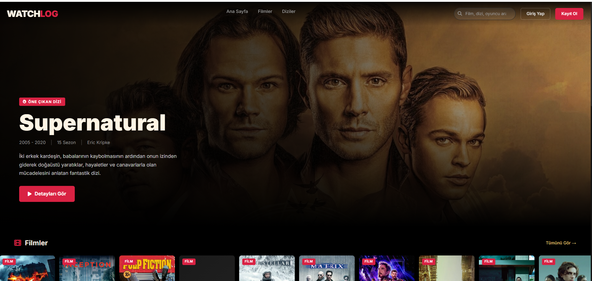
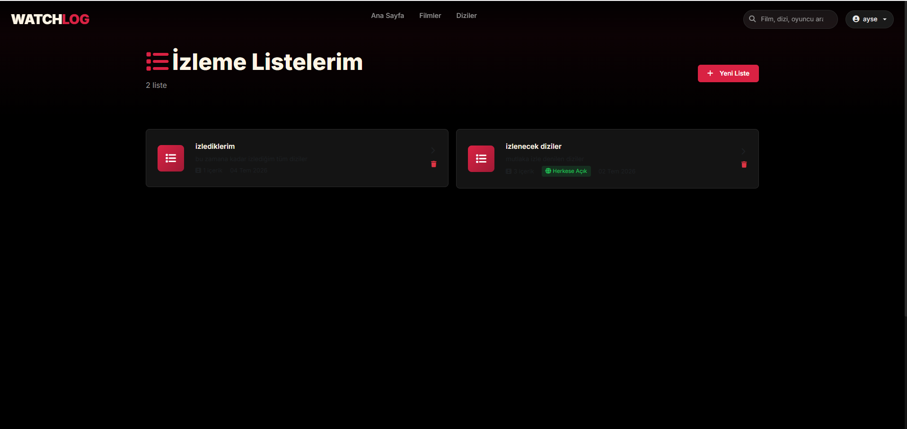
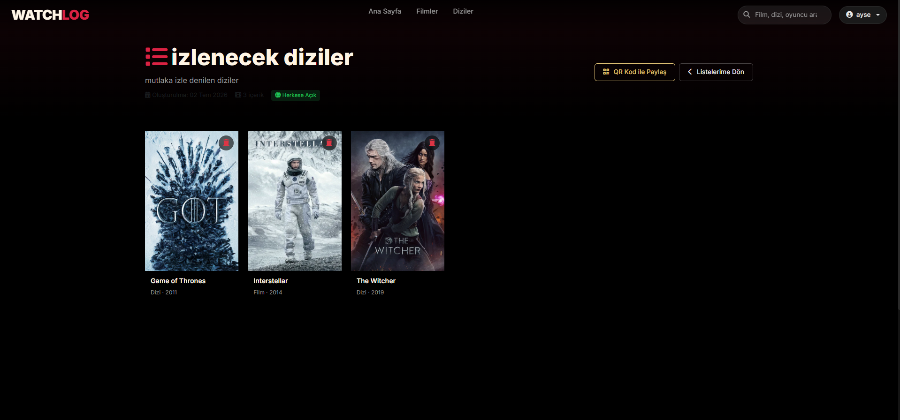
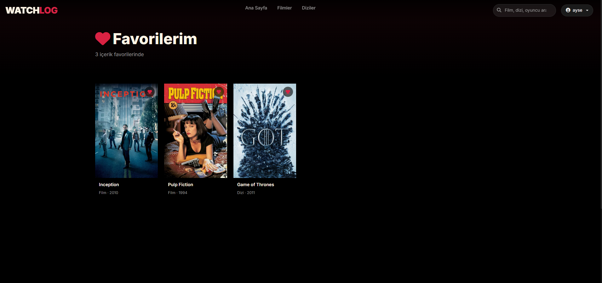
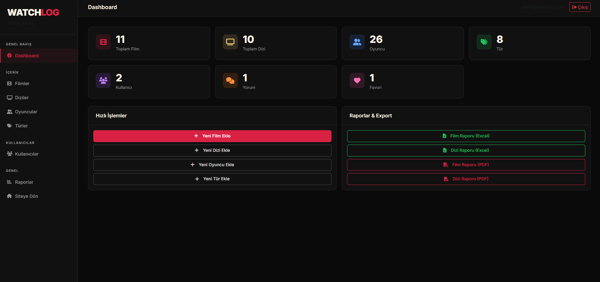
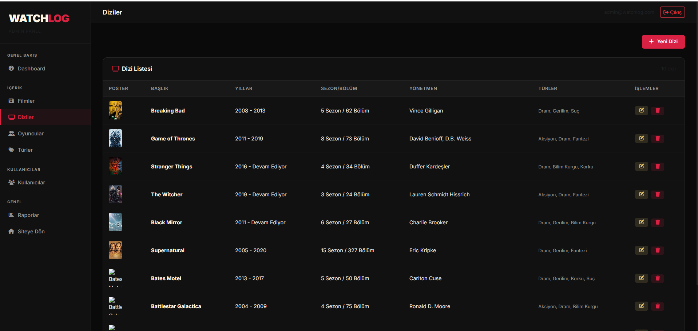
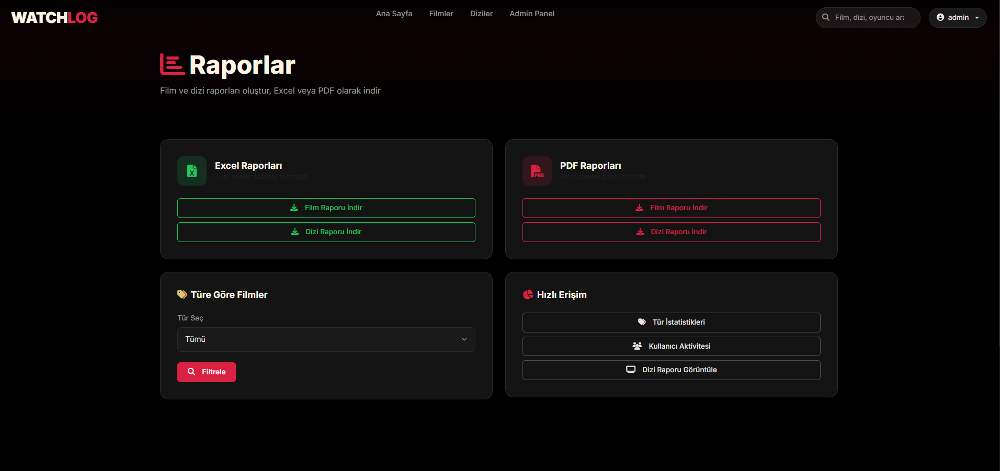
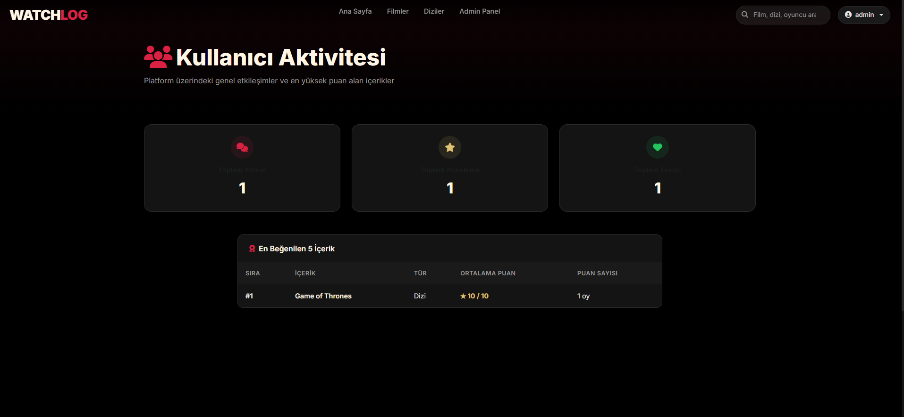

<h1 align="center">🎬 WatchLog</h1>

<p align="center">
  <strong>Film & Dizi İzleme Günlüğü ve Raporlama Sistemi</strong><br>
  Movie & Series Watch Log & Reporting System
</p>

<p align="center">
  
  
  
  
  
</p>

<p align="center">
  🇹🇷 Bu proje <strong>SoftITO Backend Developer Eğitimi</strong> kapsamında geliştirilmiş olan <strong>9. projedir</strong>.<br>
  🇬🇧 This project is the <strong>9th project</strong> developed under the <strong>SoftITO Backend Developer Training</strong>.
</p>

<p align="center">
  <a href="#-türkçe">🇹🇷 Türkçe</a> • <a href="#-english">🇬🇧 English</a>
</p>

---

# 📸 Screenshots

### 🔑 Giriş Ekranı / Login Screen
<p align="center">
  
</p>

### 🏠 Kullanıcı İzleme Listeleri / User Watchlists
<p align="center">
  
</p>

### 🎬 Liste Detayı ve İçerikler / List Details & Contents
<p align="center">
  
</p>

### ⭐ Kullanıcı Favori İçerikleri / User Favorites
<p align="center">
  
</p>

### 📊 Yönetici Paneli / Admin Dashboard
<p align="center">
  
</p>

### ⚙️ Yönetici Dizi Yönetimi / Admin Series Management
<p align="center">
  
</p>

### 📈 Gelişmiş Raporlar & İstatistikler / Advanced Reports & Statistics
<p align="center">
  
</p>

### 👥 Kullanıcı Aktivite Raporları / User Activity Reports
<p align="center">
  
</p>

---

# 🇹🇷 Türkçe

## Proje Hakkında
WatchLog, kullanıcıların izledikleri veya izlemek istedikleri film ve dizileri listeleyebildiği, favorilerine ekleyebildiği ve puanlayabildiği kapsamlı bir takip günlüğüdür. Yönetici (Admin) kullanıcıları için gelişmiş grafiksel raporlar, içerik yönetimi paneli ve kullanıcı hareketlerini analiz eden dinamik gösterge panelleri (dashboards) barındırır.

### Mimari Yapı
* **WatchLog.API**: Dapper mikro-ORM aracılığıyla veritabanı işlemlerini yürüten ve performans odaklı saklı yordamlar (stored procedures) barındıran RESTful API katmanı.
* **WatchLog.MVC**: Kullanıcı arayüzünü Bootstrap 5, ASP.NET Core Identity ve zengin modern temalar ile sunan istemci katmanı.

## Temel Özellikler
* **Rol Tabanlı Yetkilendirme**: Üye ve Yönetici rolleri ile korunan yönetim panelleri.
* **QR Kod ile Paylaşım**: Sunucu tarafında `QRCoder` paketini kullanarak oluşturulan dinamik QR kodları sayesinde listeleri hızlıca paylaşabilme.
* **Detaylı Raporlama**: En çok izlenen türler, kullanıcı aktivite analizleri ve grafiksel istatistikler.
* **Dinamik İçerikler**: Ana sayfada öne çıkan Supernatural dizisi ve genişletilmiş film/dizi kütüphanesi (Bates Motel, Split, Battlestar Galactica vb.).

## Kurulum Adımları

1. **Veritabanını Oluşturun ve Seed Edin:**
   * SQL Server Management Studio (SSMS) uygulamasını açın.
   * `WatchLog.API` klasöründeki **[WatchLog_Seeding_Without_Drop.sql](WatchLog.API/WatchLog_Seeding_Without_Drop.sql)** dosyasını açıp çalıştırın. Bu işlem tabloları, ilişkileri ve saklı yordamları otomatik olarak oluşturup Supernatural vb. içerikleri yükleyecektir.

2. **Bağlantı Dizelerini (Connection Strings) Ayarlayın:**
   * Hem **`WatchLog.API/appsettings.json`** hem de **`WatchLog.MVC/appsettings.json`** dosyalarındaki `"Server=YOUR_SQL_SERVER;"` alanını kendi yerel SQL Server adresinizle (örneğin `.`, `localhost` veya `(localdb)\MSSQLLocalDB`) güncelleyin.

3. **Projeleri Çalıştırın:**
   ```bash
   # API projesini başlatın
   cd WatchLog.API/WatchLog.API
   dotnet run

   # MVC projesini başlatın
   cd ../WatchLog.MVC
   dotnet run
   ```

4. **Yönetici Giriş Bilgileri:**
   * **E-posta**: `admin@watchlog.com`
   * **Şifre**: `Admin123!`

---

# 🇬🇧 English

## About the Project
WatchLog is a comprehensive tracking log where users can list, favorite, and rate movies and series they have watched or want to watch. It includes advanced graphical reports for Administrators, a content management panel, and dynamic dashboards that analyze user activity.

### Architectural Structure
* **WatchLog.API**: A RESTful API layer that handles database operations using Dapper micro-ORM and optimized stored procedures.
* **WatchLog.MVC**: An interactive client layer rendering the user interface with Bootstrap 5, ASP.NET Core Identity, and a premium dark theme.

## Core Features
* **Role-Based Authorization**: Protected management panels for Member and Administrator roles.
* **QR Code Sharing**: Easily share public watchlists using server-side dynamic QR codes powered by the `QRCoder` library.
* **Detailed Reporting**: Most-watched genres, user activity logs, and graphical statistics.
* **Dynamic Hero Content**: Supernatural series featured on the homepage alongside a rich movie/series catalog (Bates Motel, Split, Battlestar Galactica, etc.).

## Setup Instructions

1. **Create & Seed Database:**
   * Open SQL Server Management Studio (SSMS).
   * Open and execute the **[WatchLog_Seeding_Without_Drop.sql](WatchLog.API/WatchLog_Seeding_Without_Drop.sql)** script. This will automatically create tables, procedures, and seed Supernatural, Bates Motel, and other titles.

2. **Set Connection Strings:**
   * Replace the `"Server=YOUR_SQL_SERVER;"` portion in both **`WatchLog.API/appsettings.json`** and **`WatchLog.MVC/appsettings.json`** connection strings with your local SQL Server instance name (e.g., `.`, `localhost`, or `(localdb)\MSSQLLocalDB`).

3. **Run the Applications:**
   ```bash
   # Start the API project
   cd WatchLog.API/WatchLog.API
   dotnet run

   # Start the MVC project
   cd ../WatchLog.MVC
   dotnet run
   ```

4. **Admin Credentials:**
   * **Email**: `admin@watchlog.com`
   * **Password**: `Admin123!`
